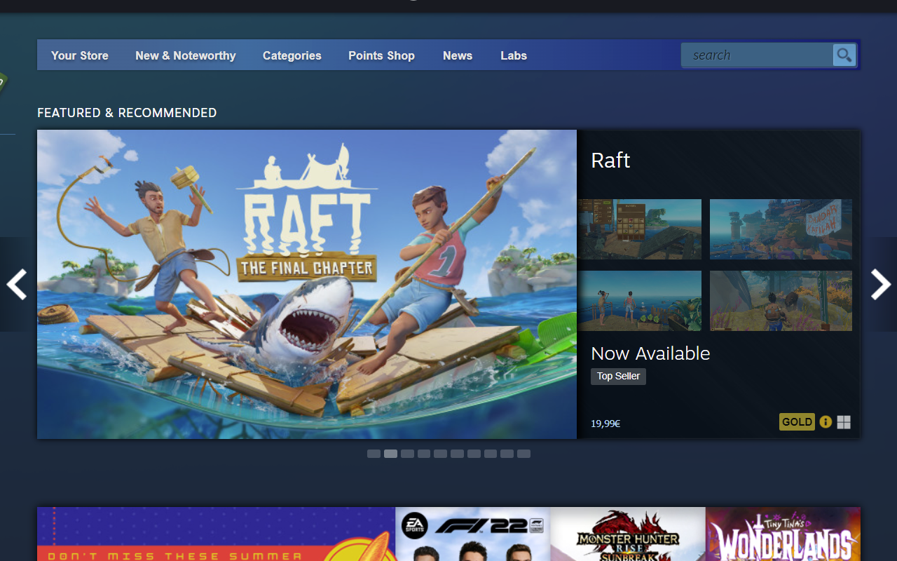

  

<h1 align="center">Show Great on Deck on Steam</h1>
<h3 align="center">great-on-deck-search</h3>

  <b>See what Games are verified for the Steam Deck and which Medal they have on ProtonDB in the Steam Store.</b>

 

  
  

## What it does
By default, Steam does not show you the Steam Deck verification status on their 
desktop website.
This Browser Extension/Add-On fixes that by requesting the verification status 
from [ProtonDB](https://www.protondb.com).
While pulling the verification data from Steam directly, this also pulls the 
medals ProtonDB gives to certain games and displays them.

Three pages do show now the medals and verification icons:
 - the store front page,
 - the app page per game
 - and the search results

Clicking on the medal on any of the pages will open the ProtonDB page for the 
app in a new tab.

*Note*: The requested data is locally cached for the session, this increases 
load times and reduces redundant requests to ProtonDB and Steam.

### Store Front Page
The medals are shown on the featured element in the bottom right corner.

  

### App Page
The medal is placed on top of the right side menu of the page.
Also the verification status is moved up to see it more quickly.

  

### Search Results
The search results show the medal and verification status on every entry.

  

## Missing Pages?
If you need this feature added to another page, open an
[issue on GitHub](https://github.com/cptpiepmatz/great-on-deck-search/issues)
and I see what I can do.

## Installation
### Store Installation
#### Chrome and other Chromium-based Browsers
1. Head over to the [web store page](https://chrome.google.com/webstore/detail/show-great-on-deck-on-ste/olagniaikhbmpdgghoifgloijcndfled).
2. Click `Add to Chrome` (or whatever your browser name is).
3. A popup should appear asking you to install the extension, accept it.
4. Head over to Steam and check the results.

#### Firefox
1. Head over to the [add-on page](https://addons.mozilla.org/firefox/addon/show-great-on-deck-on-steam/).
2. Click `Add to Firefox`.
3. Click `Add` on the popup.
4. Head over to Steam and check the results.

### Manual Installation
For the manual installation 
[clone or download the repo](https://github.com/cptpiepmatz/great-on-deck-search/archive/refs/heads/main.zip)
and put it in a directory of your choosing, just make sure that you will need 
this directory even after installation.

Chrome and Firefox do have different specifications for extensions/add-ons,
therefore you need to rename corresponding manifest.json to simply 
`manifest.json`.

Install it on:
- [Chrome](https://developer.chrome.com/docs/extensions/mv3/getstarted/#unpacked)
- [Firefox](https://developer.mozilla.org/en-US/docs/Mozilla/Add-ons/WebExtensions/Your_first_WebExtension#installing)
- [Opera, Step 4](https://dev.opera.com/extensions/basics/)

## Support
If you're feeling extra generous today, head over to my 
[Buy Me a Coffee page](https://www.buymeacoffee.com/cptpiepmatz)
and do your thing.
Or do it via [my PayPal.me page](https://paypal.me/CptPiepmatz), whatever you 
prefer.
