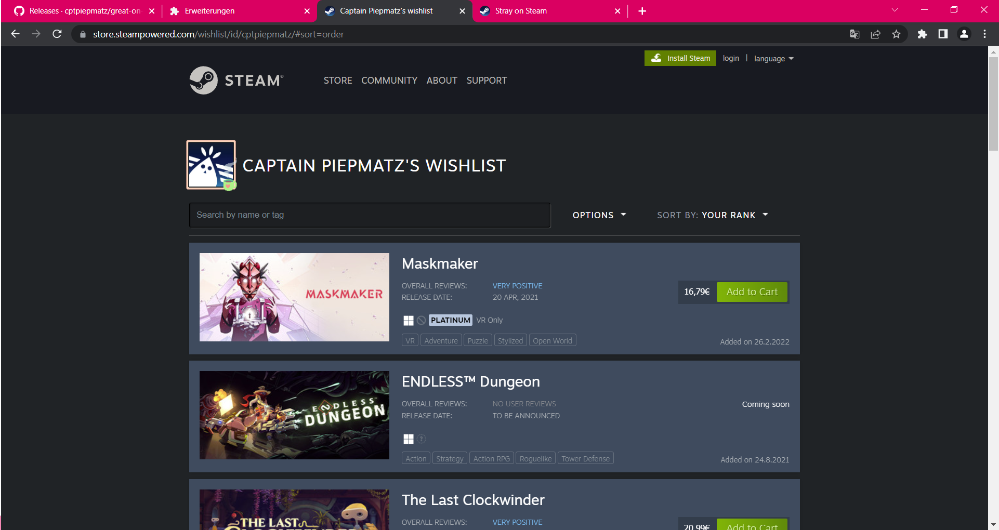

  

<h1 align="center">Show Great on Deck on Steam</h1>
<h3 align="center">great-on-deck-search</h3>

  <b>🏷️ See what games are verified for the Steam Deck and which medal they got on ProtonDB in the Steam Store.</b>

 

  
  

## What it does
By default, Steam does not show you the Steam Deck verification status on their
desktop website.
This Browser Extension/Add-On fixes that by requesting the verification status
from [ProtonDB](https://www.protondb.com) and puts them front and center on app pages for easy visibility.
While pulling the verification data from Steam directly, this also pulls the
medals ProtonDB gives to certain games and displays them on the app page too.

*Note: The extension uses session-based caching. 
This should reduce the consecutive load times significantly.*

### [SteamDB extension](https://steamdb.info/extension/) Compatibility
Since Version 1.2.0, this extension works great in combination with the SteamDB 
extension.

### [Steam Deck HQ](https://steamdeckhq.com) Support
Since Version 1.2.0, this extension also supports the
[game reviews](https://steamdeckhq.com/game-reviews/)
by the Steam Deck HQ team.
This will show their ratings, breakdowns, and the
author of the review, on the app page.

## Supported Pages
- Store Front Page
- Search Results
- App Page
- Profile Games List
- Wishlist

  
  

  
  

  
  

## Settings Menu
Since Version 1.2.0 the extension supports a settings menu.

  

This menu allows you to toggle certain features of the extension.
A reload for the page is necessary in order to see the settings take effect.

## Changelog
Changelog can be found [here](./CHANGELOG.md).

## Missing Features or Pages?
If you need any feature added or support for another page, feel free to open up an
[issue on GitHub](https://github.com/cptpiepmatz/great-on-deck-search/issues)
and I will see what I can do.

## Installation
### Store Installation
#### Chrome and other Chromium-based Browsers
1. Head over to the [web store page](https://chrome.google.com/webstore/detail/show-great-on-deck-on-ste/olagniaikhbmpdgghoifgloijcndfled).
2. Click `Add to Chrome` (or whatever your browser name is).
3. A popup should appear asking you to install the extension, accept it.
4. Head over to Steam and check the results.

#### Firefox
1. Head over to the [add-on page](https://addons.mozilla.org/firefox/addon/show-great-on-deck-on-steam/).
2. Click `Add to Firefox`.
3. Click `Add` on the popup.
4. Head over to Steam and check the results.

### Manual Installation
#### Chrome and other Chromium-based Browsers
1. Head over to the [releases tab](https://github.com/cptpiepmatz/great-on-deck-search/releases)
2. Search for the highest version appended by `+chrome`
3. Download the `.crx` file from it's assets
4. Open your browser with the `.crx` file
5. If step 4 did not work, unzip the `.crx` file and
   [load it as unpacked](https://developer.chrome.com/docs/extensions/mv3/getstarted/#unpacked)
6. Head over to Steam and check the results.

#### Firefox
1. Head over to the [releases tab](https://github.com/cptpiepmatz/great-on-deck-search/releases)
2. Search for the highest version appended by `+firefox`
3. Download the `.xpi` file from it's assets
4. Open your browser with the `.xpi` file and install it
5. Head over to Steam and check the results.

### Compile it Yourself
For compiling it yourself
[clone or download the repo](https://github.com/cptpiepmatz/great-on-deck-search/archive/refs/heads/main.zip)
and put it in a directory of your choosing, just make sure that you will need
this directory even after installation.

Chrome and Firefox do have different specifications for extensions/add-ons,
therefore you need to rename corresponding manifest.json to simply
`manifest.json`.

Build the files by using the
[`build.sh`](https://github.com/cptpiepmatz/great-on-deck-search/blob/main/build.sh).
It requires [Sass](https://sass-lang.com) and [Rollup](https://rollupjs.org)
to be globally installed.

Install it on:
- [Chrome](https://developer.chrome.com/docs/extensions/mv3/getstarted/#unpacked)
- [Firefox](https://developer.mozilla.org/en-US/docs/Mozilla/Add-ons/WebExtensions/Your_first_WebExtension#installing)
- [Opera, Step 4](https://dev.opera.com/extensions/basics/)

## Support
If you're feeling extra generous today, head over to my
[Buy Me a Coffee page](https://www.buymeacoffee.com/cptpiepmatz)
and do your thing.
Or do it via [my PayPal.me page](https://paypal.me/CptPiepmatz), whatever you
prefer.
